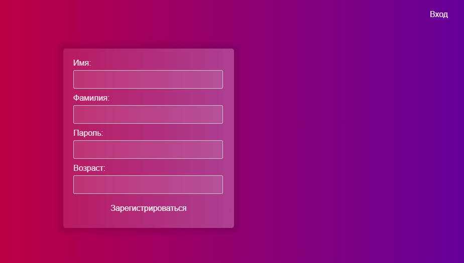
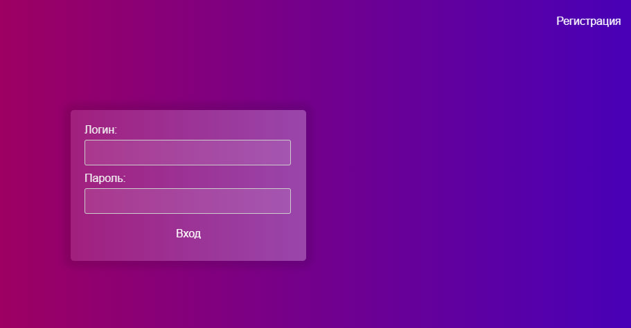
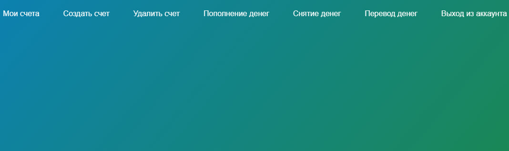

<!DOCTYPE html>
<html>
<head>

</head>
<body>
    <h2>Консольное приложение приобрело интерфейс</h2>
    <h3>Над этим приложением я работал 4 дня, но это того стоило, так как я сделал из своего консольного приложения (который тоже находится в этом репозитории) целое приложение с красивым интерфейсом</h3>
    <h3 align="center"><a style="color: orange">Внимание: Приложение было сделано на ходу и может содержать в себе ошибки, но для этого есть обработчик ошибок, в котором есть ссылка на мой ТГ. Если произойдет ошибка, то напишите мне <a href="https://t.me/Just_a_Bezhan">здесь</a> </a></h3>
    <h2>Интерфейс регистрации</h2>
    
    <h2>Интерфейс входа</h2>
    
    <h2>Интерфейс самого приложения</h2>
    
    <h1>Как запустить приложение?</h1>
    <h3>Это очень просто. Нужно лишь открыть проект с помощью PyCharm (или любого другого IDE) и запустить файл main.py.</h3>
</body>
</html>

